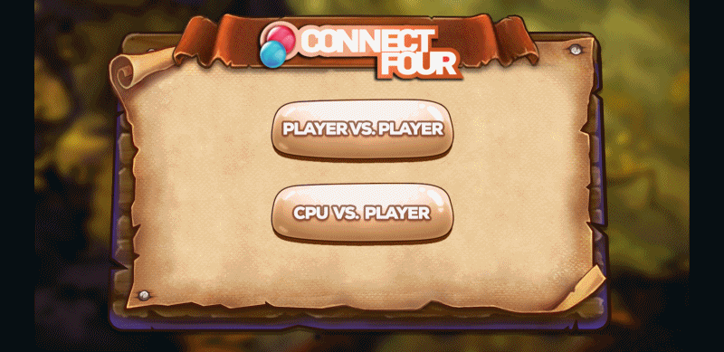

# Connect4 - Strategy Game with AI

## Description

A GUI implementation of [Connect4](https://en.wikipedia.org/wiki/Connect_Four) with an intuitive user interface and an advanced AI algorithm.
The AI is based on the minimax alpha beta pruning algorithm, various levels of difficulty are proposed based on the depth limit (how far we look ahead).

## Platforms

Connect4 is built using the the framework Cocos2d-x (C++). it's a cross-platform framework, so the game can be deployed to PC, Mac, iOS and Android.

This repository focuses on the android implementation, but changes can be easily made to adapt to other platforms if needed

See the cocos2d-x website for more information :

```
https://cocos2d-x.org/cocos2dx
```

## Screenshots / Preview


### **Game Features:**

- Player has various levels of difficulty against AI
- Player vs player mode is available

## Prerequisites

This game is built using cocos2d-x v3.16, so depending on your machine and target platform, here are the requirements : 

- Mac OS X 10.7+, Xcode 7+
- Ubuntu 12.10+, CMake 2.6+
- Windows 7+, VS 2013+ (requires Visual C++ Redistributable for Visual Studio 2012 x86 and Visual C++ Redistributable for Visual Studio 2010 x86)
- Python 2.7.5+, **NOT Python 3+**
- NDK r11+ is required to build Android games (tested with r14)
- Android Studio 2.3.3+ to build Android games (tested with 2.3.3 and 3.0)
- JRE or JDK 1.6+ is required for web publishing